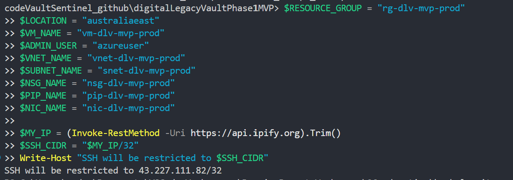
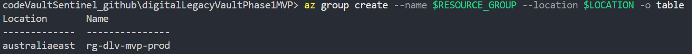
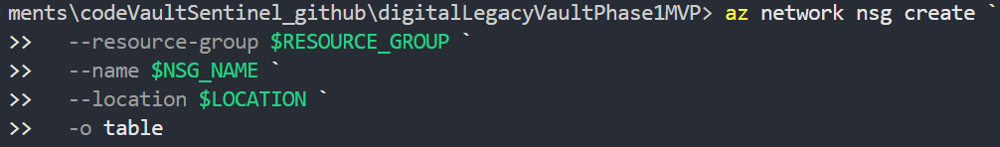
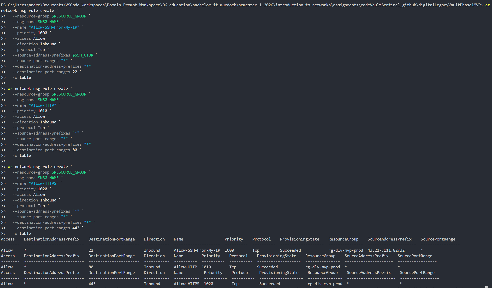
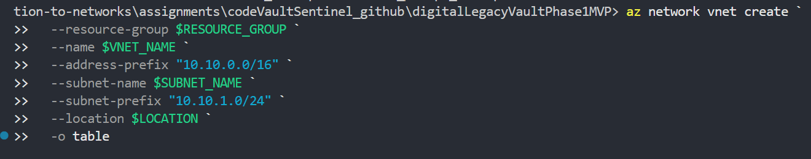
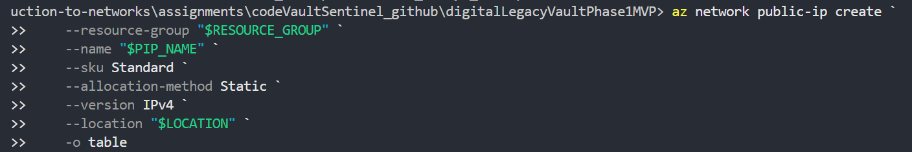
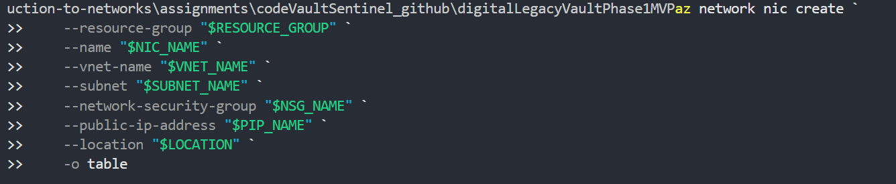
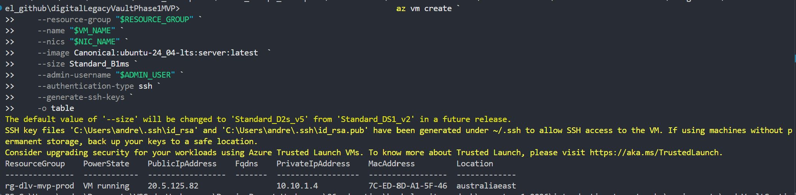
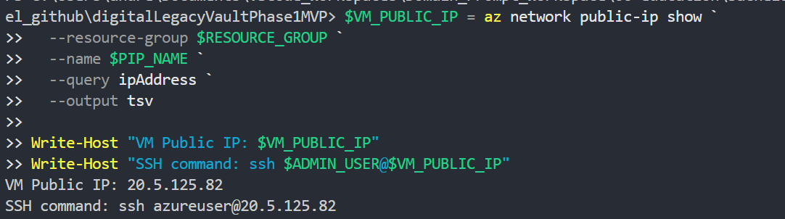
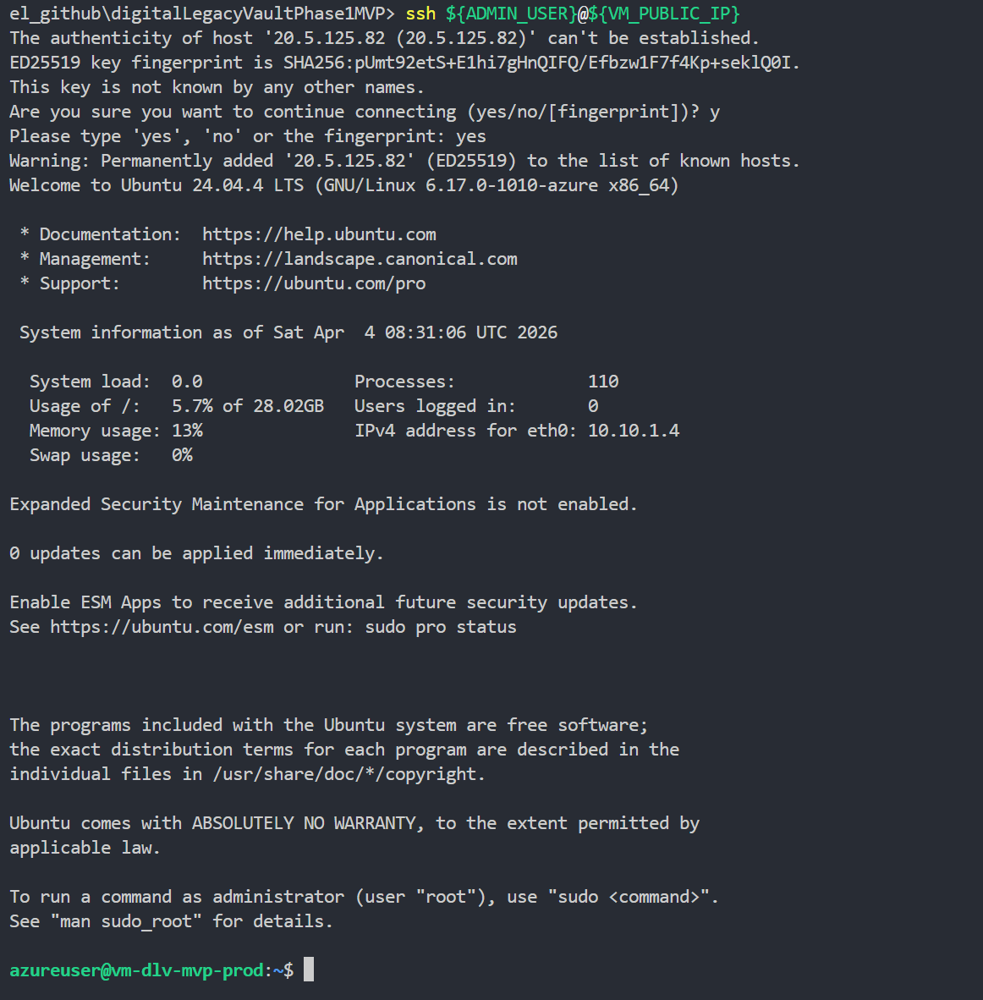

# Provision Secure Azure Base Infrastructure

## 1. Objective

Provision the minimum production-safe Azure foundation for Phase 1 of ICT171 Digital Legacy Vault MVP.

The outcome for this task is:

- One Ubuntu 24.04 LTS VM (B1ms) [Complete] ✅
- One static public IPv4 address [Complete] ✅
- NSG inbound rules that allow HTTP and HTTPS publicly and restrict SSH to my IP/CIDR [Complete] ✅
- Successful SSH access using key authentication [Complete] ✅

## 2. Preconditions

Before running commands, confirm all items below:

- Azure subscription is active and billing is enabled [Complete] ✅
- Azure CLI is installed locally [Complete] ✅
- I can sign in with `az login` [Complete] ✅
- I know my subscription ID [Complete] ✅
- I have SSH client installed locally [Complete] ✅
- I will use this naming convention: [Complete]✅
  - `RESOURCE_GROUP=rg-dlv-mvp-prod`
  - `LOCATION=australiaeast`
  - `VM_NAME=vm-dlv-mvp-prod`
  - `ADMIN_USER=azureuser`
  - `VNET_NAME=vnet-dlv-mvp-prod`
  - `SUBNET_NAME=snet-dlv-mvp-prod`
  - `NSG_NAME=nsg-dlv-mvp-prod`
  - `PIP_NAME=pip-dlv-mvp-prod`
  - `NIC_NAME=nic-dlv-mvp-prod`
- I have identified my current public IP for SSH allowlisting [Complete] ✅
  - Get public IP
    - (Invoke-RestMethod -Uri https://api.ipify.org).Trim()
    - 43.227.111.82

## 3. Exact commands

Run the following commands in order.
Replace `YOUR_SUBSCRIPTION_ID` with my real value before running Step 1.

**Step 1: Sign in and set subscription** [Complete] ✅

```bash
az login
az account set --subscription YOUR_SUBSCRIPTION_ID
az account show -o table
```

**Step 2: Define variables for consistent naming** [Complete] ✅

The shell variables are created for the current terminal session only

Bash Code

```bash
RESOURCE_GROUP="rg-dlv-mvp-prod"
LOCATION="australiaeast"
VM_NAME="vm-dlv-mvp-prod"
ADMIN_USER="azureuser"
VNET_NAME="vnet-dlv-mvp-prod"
SUBNET_NAME="snet-dlv-mvp-prod"
NSG_NAME="nsg-dlv-mvp-prod"
PIP_NAME="pip-dlv-mvp-prod"
NIC_NAME="nic-dlv-mvp-prod"

MY_IP=$(curl -s https://api.ipify.org)
SSH_CIDR="${MY_IP}/32"
echo "SSH will be restricted to ${SSH_CIDR}"
```

Powershell Code

```powershell
$RESOURCE_GROUP = "rg-dlv-mvp-prod"
$LOCATION = "australiaeast"
$VM_NAME = "vm-dlv-mvp-prod"
$ADMIN_USER = "azureuser"
$VNET_NAME = "vnet-dlv-mvp-prod"
$SUBNET_NAME = "snet-dlv-mvp-prod"
$NSG_NAME = "nsg-dlv-mvp-prod"
$PIP_NAME = "pip-dlv-mvp-prod"
$NIC_NAME = "nic-dlv-mvp-prod"

$MY_IP = (Invoke-RestMethod -Uri https://api.ipify.org).Trim()
$SSH_CIDR = "$MY_IP/32"
Write-Host "SSH will be restricted to $SSH_CIDR"
```



**Step 3: Create resource group** [Complete] ✅

Bash Code

```bash
az group create --name "$RESOURCE_GROUP" --location "$LOCATION" -o table
```

Powershell Code

```powershell
az group create --name $RESOURCE_GROUP --location $LOCATION -o table
```



**Step 4: Create NSG** [Complete] ✅

Bash Code

```bash
az network nsg create \
--resource-group "$RESOURCE_GROUP" \
--name "$NSG_NAME" \
--location "$LOCATION" \
-o table
```

Powershell Code

```powershell
az network nsg create `
  --resource-group $RESOURCE_GROUP `
  --name $NSG_NAME `
  --location $LOCATION `
  -o table
```



Bash Code - Ports 22, 80 and 443

```bash
az network nsg rule create \
--resource-group "$RESOURCE_GROUP" \
--nsg-name "$NSG_NAME" \
--name "Allow-SSH-From-My-IP" \
--priority 1000 \
--access Allow \
--direction Inbound \
--protocol Tcp \
--source-address-prefixes "$SSH_CIDR" \
--source-port-ranges "*" \
--destination-address-prefixes "*" \
--destination-port-ranges 22 \
-o table

az network nsg rule create \
--resource-group "$RESOURCE_GROUP" \
--nsg-name "$NSG_NAME" \
--name "Allow-HTTP" \
--priority 1010 \
--access Allow \
--direction Inbound \
--protocol Tcp \
--source-address-prefixes "*" \
--source-port-ranges "*" \
--destination-address-prefixes "*" \
--destination-port-ranges 80 \
-o table

az network nsg rule create \
--resource-group "$RESOURCE_GROUP" \
--nsg-name "$NSG_NAME" \
--name "Allow-HTTPS" \
--priority 1020 \
--access Allow \
--direction Inbound \
--protocol Tcp \
--source-address-prefixes "*" \
--source-port-ranges "*" \
--destination-address-prefixes "*" \
--destination-port-ranges 443 \
-o table
```

Powershell Code - Ports 22, 80 and 443

```powershell
az network nsg rule create `
  --resource-group $RESOURCE_GROUP `
  --nsg-name $NSG_NAME `
  --name "Allow-SSH-From-My-IP" `
  --priority 1000 `
  --access Allow `
  --direction Inbound `
  --protocol Tcp `
  --source-address-prefixes $SSH_CIDR `
  --source-port-ranges "*" `
  --destination-address-prefixes "*" `
  --destination-port-ranges 22 `
  -o table

az network nsg rule create `
  --resource-group $RESOURCE_GROUP `
  --nsg-name $NSG_NAME `
  --name "Allow-HTTP" `
  --priority 1010 `
  --access Allow `
  --direction Inbound `
  --protocol Tcp `
  --source-address-prefixes "*" `
  --source-port-ranges "*" `
  --destination-address-prefixes "*" `
  --destination-port-ranges 80 `
  -o table

az network nsg rule create `
  --resource-group $RESOURCE_GROUP `
  --nsg-name $NSG_NAME `
  --name "Allow-HTTPS" `
  --priority 1020 `
  --access Allow `
  --direction Inbound `
  --protocol Tcp `
  --source-address-prefixes "*" `
  --source-port-ranges "*" `
  --destination-address-prefixes "*" `
  --destination-port-ranges 443 `
  -o table
```



**Step 6: Create VNet and subnet** [Complete] ✅

Bash code

```bash
az network vnet create \
--resource-group "$RESOURCE_GROUP" \
--name "$VNET_NAME" \
--address-prefix "10.10.0.0/16" \
--subnet-name "$SUBNET_NAME" \
--subnet-prefix "10.10.1.0/24" \
--location "$LOCATION" \
-o table
```

Powershell code

```powershell
az network vnet create `
  --resource-group $RESOURCE_GROUP `
  --name $VNET_NAME `
  --address-prefix "10.10.0.0/16" `
  --subnet-name $SUBNET_NAME `
  --subnet-prefix "10.10.1.0/24" `
  --location $LOCATION `
  -o table
```



**Step 7: Create static public IP** [Complete] ✅

Bash code

```bash
az network public-ip create \
--resource-group "$RESOURCE_GROUP" \
--name "$PIP_NAME" \
--sku Standard \
--allocation-method Static \
--version IPv4 \
--location "$LOCATION" \
-o table
```

Powershell code

```powershell
az network public-ip create `
--resource-group "$RESOURCE_GROUP" `
--name "$PIP_NAME" `
--sku Standard `
--allocation-method Static `
--version IPv4 `
--location "$LOCATION" `
-o table
```



**Step 8: Create NIC and attach NSG + public IP** [Complete] ✅

Bash code

```bash
az network nic create \
--resource-group "$RESOURCE_GROUP" \
--name "$NIC_NAME" \
--vnet-name "$VNET_NAME" \
--subnet "$SUBNET_NAME" \
--network-security-group "$NSG_NAME" \
--public-ip-address "$PIP_NAME" \
--location "$LOCATION" \
-o table
```

Powershell code

```powershell
az network nic create `
--resource-group "$RESOURCE_GROUP" `
--name "$NIC_NAME" `
--vnet-name "$VNET_NAME" `
--subnet "$SUBNET_NAME" `
--network-security-group "$NSG_NAME" `
--public-ip-address "$PIP_NAME" `
--location "$LOCATION" `
-o table
```



**Step 9: Create Ubuntu VM with SSH key authentication** [Complete] ✅

Bash Code

```bash
az vm create \
--resource-group "$RESOURCE_GROUP" \
--name "$VM_NAME" \
--nics "$NIC_NAME" \
--image Canonical:ubuntu-24_04-lts:server:latest \
--size Standard_B1ms \
--admin-username "$ADMIN_USER" \
--authentication-type ssh \
--generate-ssh-keys \
-o table
```

Powershell Code

```powershell
az vm create `
--resource-group "$RESOURCE_GROUP" `
--name "$VM_NAME" `
--nics "$NIC_NAME" `
--image Canonical:ubuntu-24_04-lts:server:latest `
--size Standard_B1ms `
--admin-username "$ADMIN_USER" `
--authentication-type ssh `
--generate-ssh-keys `
-o table
```



**Step 10: Fetch VM public IP and print SSH command** [Complete] ✅

Bash code

```bash
VM_PUBLIC_IP=$(az network public-ip show \
--resource-group "$RESOURCE_GROUP" \
--name "$PIP_NAME" \
--query ipAddress \
--output tsv)

echo "VM Public IP: $VM_PUBLIC_IP"
echo "SSH command: ssh ${ADMIN_USER}@${VM_PUBLIC_IP}"
```

Powershell code

```powershell
$VM_PUBLIC_IP = az network public-ip show `
  --resource-group $RESOURCE_GROUP `
  --name $PIP_NAME `
  --query ipAddress `
  --output tsv

Write-Host "VM Public IP: $VM_PUBLIC_IP"
Write-Host "SSH command: ssh $ADMIN_USER@$VM_PUBLIC_IP"
```



**Step 11: Test SSH access** [Complete] ✅

Bash code

```bash
ssh ${ADMIN_USER}@${VM_PUBLIC_IP}
```

Powershell code

```powershell
ssh ${ADMIN_USER}@${VM_PUBLIC_IP}
```



## 4. Validation commands and expected result

- Bash code snippets were converted to powershell and both snippets are in exact commands section
- Code snippet for Step 9, ubuntu image, has to be modified as error was encountered when using the alias in the CLI
  
## 5. Screenshot checklist

- Screenshot added to every step

## 6. Issues encountered and fixes

- No major issues encountered nearly all code snippets ran with no errors
  
## 7. Final status

- All steps successfully completed
- In future will need to add in the code snippets to support Powershell CLI