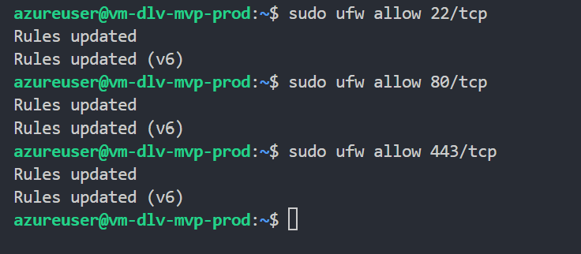
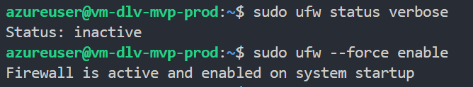
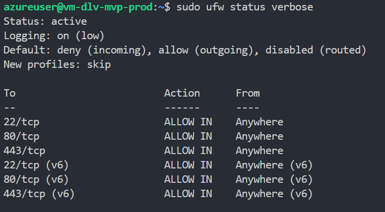
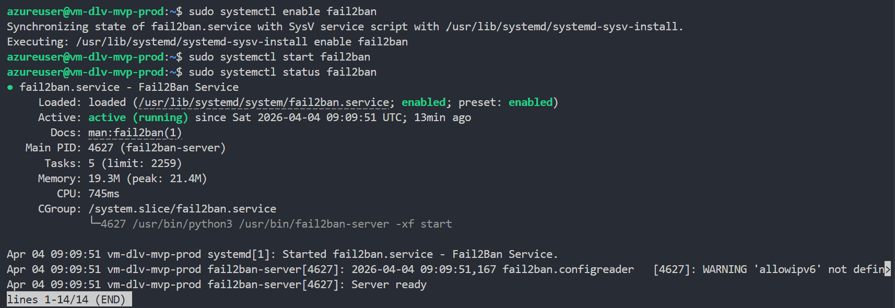
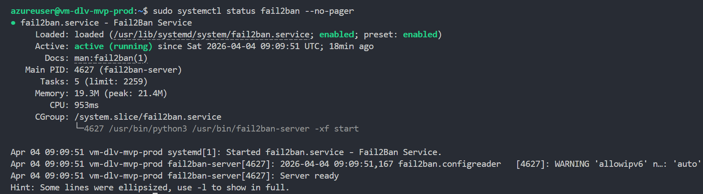
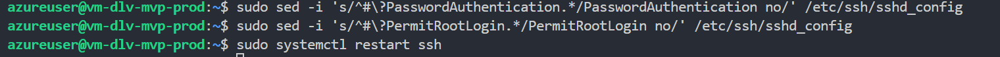
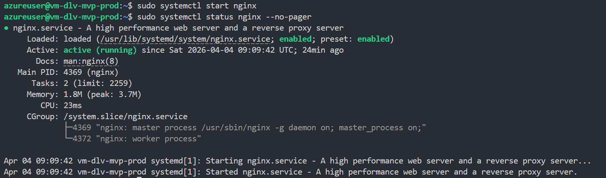
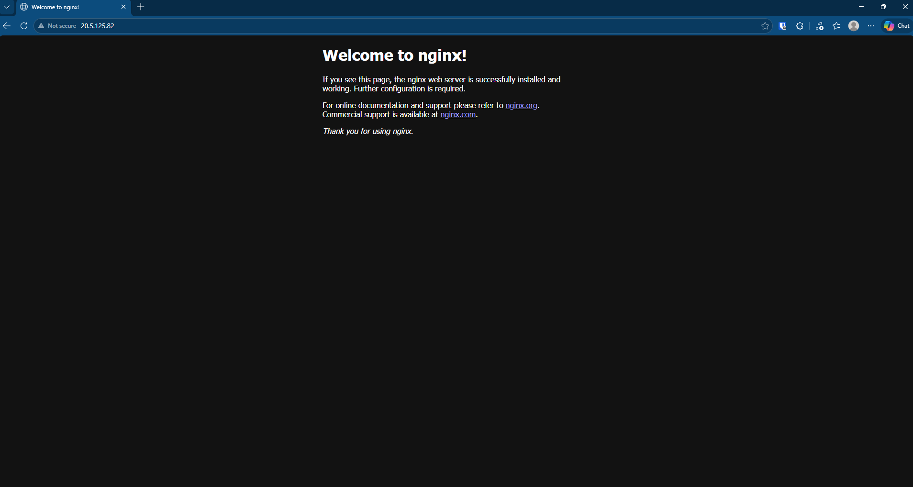

# Harden Ubuntu Server

## 1. Objective

Harden the Ubuntu 24.04 LTS Azure VM so it is ready for Phase 1 public exposure.

The outcome for this task is:

- System packages updated [Complete] ✅
- Required security packages installed
- UFW enabled with SSH, HTTP, and HTTPS allowed
- fail2ban installed and running
- Password-based SSH disabled
- Root SSH login disabled

## 2. Preconditions

Before running commands, confirm all items below:

- I have already completed Azure provisioning and can SSH to the VM [Complete] ✅
- I know the VM public IP address [Complete] ✅
- I can connect using the Azure admin username `azureuser` [Complete] ✅
- I have the private key corresponding to the VM SSH key pair [Complete] ✅
- I have a terminal open on my local machine or in VS Code [Complete] ✅
- I know the public IP or CIDR range for my own workstation if I want to verify SSH access from another host [Complete] ✅
- I will run the server commands on the Ubuntu VM, not on my local Windows machine [Complete] ✅

## 3. Exact commands

Run the following commands in order.

**Step 1: Connect to the Azure VM** [Complete] ✅

Bash Code

```bash
ssh azureuser@<VM_PUBLIC_IP>
```


**Step 2: Update package lists and install required packages** [Complete] ✅

Bash Code

```bash
sudo apt update && sudo apt upgrade -y
sudo apt install -y ufw fail2ban nginx git python3 python3-venv python3-pip sqlite3
```

Run commands in the CLI

azureuser@vm-dlv-mvp-prod:~$ sudo apt update && sudo apt upgrade -y
azureuser@vm-dlv-mvp-prod:~$ sudo apt install -y ufw fail2ban nginx git python3 python3-venv python3-pip sqlite3

Result: package installs and updates completed without error

**Step 3: Allow the required firewall ports** [Complete] ✅

Bash Code

```bash
sudo ufw allow 22/tcp
sudo ufw allow 80/tcp
sudo ufw allow 443/tcp
```



**Step 4: Enable UFW** [Complete] ✅

Bash Code

```bash
sudo ufw --force enable
sudo ufw status verbose
```

PowerShell Code

```powershell
ssh azureuser@<VM_PUBLIC_IP> "sudo ufw --force enable && sudo ufw status verbose"
```




**Step 5: Enable and start fail2ban** [Complete] ✅

Fail2ban is a Linux intrusion-prevention tool that watches log files for repeated suspicious behavior, then automatically blocks the source IP for a period of time.

It protects SSH by looking for repeated failed login attempts. If someone keeps guessing passwords or hammering the login prompt, fail2ban can add a temporary firewall rule to block that IP.

Bash Code

```bash
sudo systemctl enable fail2ban
sudo systemctl start fail2ban
sudo systemctl status fail2ban --no-pager
```




**Step 6: Disable password authentication and root SSH login** [Complete] ✅

Disabling password authentication and root SSH login reduces the two most common paths attackers use to get into a Linux server.

Password authentication:

Stops brute-force guessing attacks against SSH passwords.
Forces key-based login, which is much harder to guess or automate.
Removes risk from weak, reused, or stolen passwords.
Root SSH login:

Prevents direct login as the most privileged account on the server.
Makes attackers go through a normal user account first, which adds logging and an extra barrier.
Reduces the impact of credential theft, because root cannot be targeted directly over SSH.

Bash Code

```bash
sudo sed -i 's/^#\?PasswordAuthentication.*/PasswordAuthentication no/' /etc/ssh/sshd_config
sudo sed -i 's/^#\?PermitRootLogin.*/PermitRootLogin no/' /etc/ssh/sshd_config
sudo systemctl restart ssh
```



**Step 7: Confirm Nginx is installed and enabled** [Complete] ✅

Bash Code

```bash
sudo systemctl enable nginx
sudo systemctl start nginx
sudo systemctl status nginx --no-pager
```



## 4. Validation commands and expected result

- Confirmed nginx webserver is running in web browser 
  
## 5. Screenshot checklist

- Screenshots for each step have been added to the document
  
## 6. Issues encountered and fixes

- No issues encountered
  
## 7. Final status

- All steps complete with no issues
- Added additional context for some steps that weren't fully understood.