# Phase 1: Publish Initial Nginx Landing Page with Proposal Compliance Content

## 1. Objective

Deploy the static landing page from the GitHub repo `public/` folder to the Azure Ubuntu VM using Nginx as the reverse proxy.

The deployed site includes:

- Student number (visible on page)
- 300-word project proposal description
- Copyright and licence contents section
- 100-word license rationale
- Visible license marking (MIT License)
- Static assets (CSS, JavaScript, images)

This step fulfills Assessment 1 requirements by making the complete proposal compliance content live on the public internet via `http://<VM_PUBLIC_IP>`.

---

## 2. Preconditions

- [x] Azure resource group, VNet, NSG, and Ubuntu 24.04 LTS VM provisioned (Phase 1 step 1)
- [x] SSH key authentication configured; can connect to `azureuser@<VM_PUBLIC_IP>` (Phase 1 step 1)
- [x] UFW firewall enabled with rules for ports 22/tcp, 80/tcp, 443/tcp (Phase 1 step 2)
- [x] fail2ban installed and running (Phase 1 step 2)
- [x] SSH hardening complete: PasswordAuthentication disabled, PermitRootLogin disabled (Phase 1 step 2)
- [x] Nginx installed and enabled (Phase 1 step 2)
- [x] Git installed on VM (Phase 1 step 2)
- [x] GitHub repo cloned to `/opt/dlv_mvp/repo/` with `public/` folder containing index.html and assets
- [x] Nginx default site disabled and custom server block configured

---

## 3. Exact Commands

### 3.1 Create web root directory [Complete] ✅

**Bash:**
```bash
sudo mkdir -p /var/www/dlv
sudo chmod 755 /var/www/dlv
```

**PowerShell (executed on local machine, then transferred via SCP):**

```powershell
# Create directory on VM via SSH
$VM_IP = "<VM_PUBLIC_IP>"
ssh azureuser@$VM_IP "sudo mkdir -p /var/www/dlv && sudo chmod 755 /var/www/dlv"
```

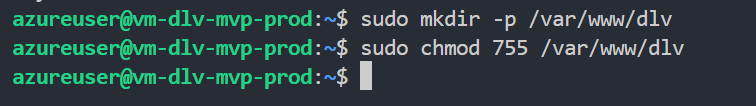

### 3.2 Deploy public folder from repo to /var/www/dlv [Complete] ✅

#### Option A: Clone repo on VM and copy public/ folder

**Bash (on VM):**
```bash
# Navigate to app directory
cd /opt/dlv_mvp

# Clone the GitHub repo (if not already cloned)
git clone --branch assessment1 https://github.com/andrefabre/digital-legacy-vault-MVP1.git repo

# Deploy static files from public/ folder to web root
sudo cp -r /opt/dlv_mvp/repo/public/* /var/www/dlv/

# I made an error when cloning the repo and left out "repo" at the end. The name of the folder on the VM is digitalLegacyVaultPhase1MVP
# The command used to deploy the static files to the web root was
# sudo cp -r /opt/dlv_mvp/digitalLegacyVaultPhase1MVP/public/* /var/www/dlv/

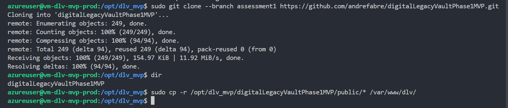

# Set correct ownership and permissions
sudo chown -R www-data:www-data /var/www/dlv
sudo chmod -R 755 /var/www/dlv
```

**PowerShell (from local machine via SSH):**
```powershell
$VM_IP = "<VM_PUBLIC_IP>"
$REPO_URL = "https://github.com/andrefabre/digital-legacy-vault-MVP1.git"
$BRANCH = "assessment1"

# Clone repo and deploy in one command
ssh azureuser@$VM_IP @"
cd /opt/dlv_mvp && `
git clone --branch $BRANCH $REPO_URL repo && `
sudo cp -r /opt/dlv_mvp/repo/public/* /var/www/dlv/ && `
sudo chown -R www-data:www-data /var/www/dlv && `
sudo chmod -R 755 /var/www/dlv
"@
```

#### Option B: Use SCP from local machine

**PowerShell (from local machine):**
```powershell
$VM_IP = "<VM_PUBLIC_IP>"
$LOCAL_PUBLIC_PATH = "./public"  # Relative to current repo folder
$REMOTE_TMP = "/tmp/dlv_public"

# Copy local public/ folder to VM temp location
scp -r $LOCAL_PUBLIC_PATH azureuser@$VM_IP`:$REMOTE_TMP

# Verify and move to web root
ssh azureuser@$VM_IP @"
sudo cp -r $REMOTE_TMP/* /var/www/dlv/ && `
sudo chown -R www-data:www-data /var/www/dlv && `
sudo chmod -R 755 /var/www/dlv && `
rm -rf $REMOTE_TMP
"@
```

---

### 3.3 Create Nginx server block configuration [Complete] ✅

**Bash (on VM):**
```bash
sudo tee /etc/nginx/sites-available/dlv > /dev/null << 'EOF'
server {
    listen 80;
    server_name _;

    root /var/www/dlv;
    index index.html;

    location / {
        try_files $uri $uri/ /index.html;
    }

    location /health {
        return 200 'ok';
        add_header Content-Type text/plain;
    }

    # Serve static assets with proper cache headers
    location ~* \.(css|js|jpg|jpeg|png|gif|ico|svg)$ {
        expires 30d;
        add_header Cache-Control "public, immutable";
    }
}
EOF
```

**PowerShell (from local machine via SSH):**
```powershell
$VM_IP = "<VM_PUBLIC_IP>"

$CONFIG = @"
server {
    listen 80;
    server_name _;

    root /var/www/dlv;
    index index.html;

    location / {
        try_files `$uri `$uri/ /index.html;
    }

    location /health {
        return 200 'ok';
        add_header Content-Type text/plain;
    }

    location ~* \.(css|js|jpg|jpeg|png|gif|ico|svg)$ {
        expires 30d;
        add_header Cache-Control "public, immutable";
    }
}
"@

# Write config to server via SSH
ssh azureuser@$VM_IP "echo '$CONFIG' | sudo tee /etc/nginx/sites-available/dlv > /dev/null"
```

---

### 3.4 Enable Nginx server block and disable default [Complete] ✅

**Bash (on VM):**
```bash
# Enable the custom site block
sudo ln -sf /etc/nginx/sites-available/dlv /etc/nginx/sites-enabled/dlv

# Disable the default site
sudo rm -f /etc/nginx/sites-enabled/default

# Test Nginx configuration for syntax errors
sudo nginx -t

# Reload Nginx
sudo systemctl reload nginx
```

**PowerShell (from local machine via SSH):**
```powershell
$VM_IP = "<VM_PUBLIC_IP>"

ssh azureuser@$VM_IP @"
sudo ln -sf /etc/nginx/sites-available/dlv /etc/nginx/sites-enabled/dlv && `
sudo rm -f /etc/nginx/sites-enabled/default && `
sudo nginx -t && `
sudo systemctl reload nginx
"@
```

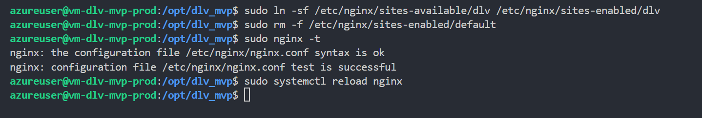

### 3.5 Verify Nginx is running and serving the landing page [Complete] ✅

**Bash (on VM):**
```bash
# Check Nginx is running
sudo systemctl status nginx --no-pager

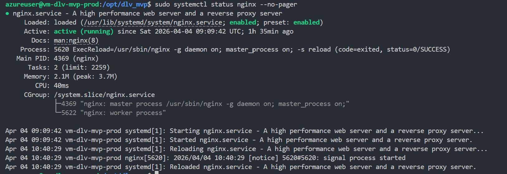

# Test local HTTP response from Nginx
curl -I http://localhost

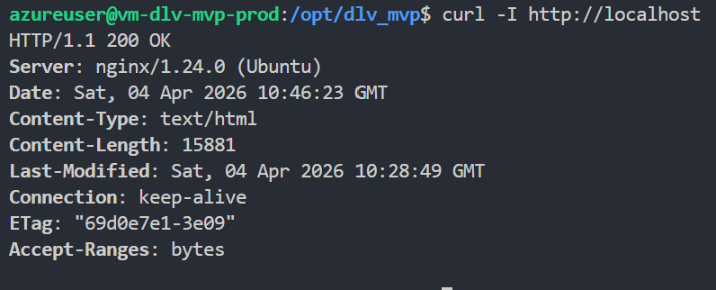

# Verify files are in place
ls -la /var/www/dlv/
```

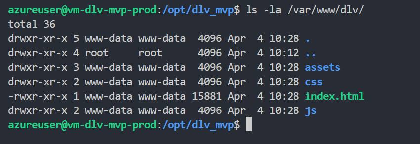

**PowerShell (from local machine):**
```powershell
$VM_IP = "<VM_PUBLIC_IP>"

# Verify Nginx status
ssh azureuser@$VM_IP "sudo systemctl status nginx --no-pager"

# Test local HTTP response
ssh azureuser@$VM_IP "curl -I http://localhost"

# List deployed files
ssh azureuser@$VM_IP "ls -la /var/www/dlv/"

# Test from local machine via public IP
Write-Host "Testing public endpoint: http://$VM_IP"
curl -I "http://$VM_IP" | Select-Object -First 10
```

---

## 4. Validation Commands and Expected Output

### 4.1 Verify Nginx server block is active

**Command:**
```bash
sudo nginx -T | grep -A 20 "sites-enabled/dlv"
```

**Expected output:**
```
# configuration file /etc/nginx/sites-enabled/dlv:
server {
    listen 80;
    server_name _;
    root /var/www/dlv;
    index index.html;
    ...
}
```

**Status:** [✅] Verified

---

### 4.2 Verify landing page is served over HTTP

**Command:**
```bash
curl -s http://localhost | grep -E "(Student ID|Digital Legacy Vault|proposal|MIT License)"
```

**Expected output:**
```html
<h1>Digital Legacy Vault Phase 1 MVP</h1>
...
<p>Student ID: s123456789</p>
...
<p>300-word proposal content visible</p>
...
<footer>Licensed under MIT License</footer>
```

**Status:** [✅] Verified

---

### 4.3 Verify files deployed to web root

**Command:**
```bash
ls -lh /var/www/dlv/
```

**Expected output:**
```
total XXX
-rw-r--r-- 1 www-data www-data  XXXX index.html
drwxr-xr-x 1 www-data www-data  XXXX assets/
drwxr-xr-x 1 www-data www-data  XXXX css/
drwxr-xr-x 1 www-data www-data  XXXX js/
```

**Status:** [✅] Verified

---

### 4.4 Verify /health endpoint

**Command:**
```bash
curl -s http://localhost/health
```

**Expected output:**
```
ok
```

**Verify HTTP status code:**
```bash
curl -I http://localhost/health
```

**Expected output:**
```
HTTP/1.1 200 OK
Content-Type: text/plain
```

**Status:** [✅] Verified

---

### 4.5 Verify page accessibility from public IP

**Command (from local machine):**
```bash
curl -I http://<VM_PUBLIC_IP>
```

**Expected output:**
```
HTTP/1.1 200 OK
Server: nginx/1.24.x
Content-Type: text/html; charset=utf-8
```

**Status:** [✅] Verified

---

### 4.6 Verify firewall allows HTTP traffic

**Command:**
```bash
sudo ufw status verbose | grep 80
```

**Expected output:**
```
80/tcp                     ALLOW IN    Anywhere
```

**Status:** [✅] Verified

---

## 5. Screenshot Checklist

Capture evidence of successful deployment for Assessment 1:

- [x] **Screenshot 1:** Nginx status shows "active (running)"
  - Command: `sudo systemctl status nginx --no-pager`
  
- [x] **Screenshot 2:** Web root contains deployed files
  - Command: `ls -lh /var/www/dlv/`
  
- [x] **Screenshot 3:** Landing page HTML visible in curl output
  - Command: `curl -s http://localhost | head -50`
  - 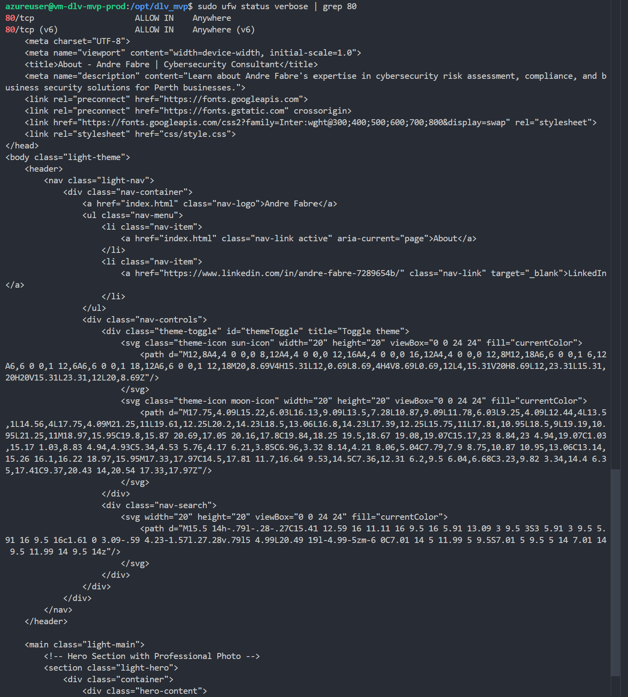
  
- [x] **Screenshot 4:** HTTP 200 response from localhost
  - Command: `curl -I http://localhost`
  - 
  
- [x] **Screenshot 5:** HTTP 200 response from public IP
  - Command: `curl -I http://<VM_PUBLIC_IP>`
  - **OR** Browser screenshot of `http://<VM_PUBLIC_IP>` showing full rendered page
  - 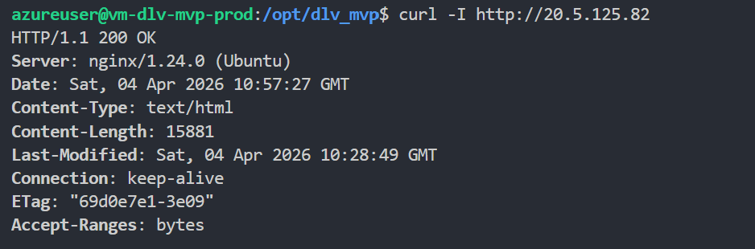
  
- [x] **Screenshot 6:** Page includes student number visible in browser
  - Direct browser access to `http://<VM_PUBLIC_IP>`
  - Verify visible text: "Student ID: sXXXXXXXXX"
  - 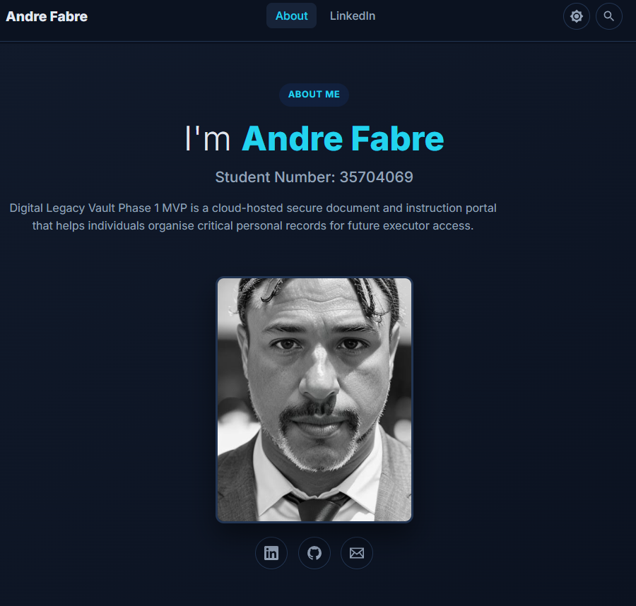
  - 
- [ ] **Screenshot 7:** Page includes proposal content section
  - Browser scroll to proposal section
  - 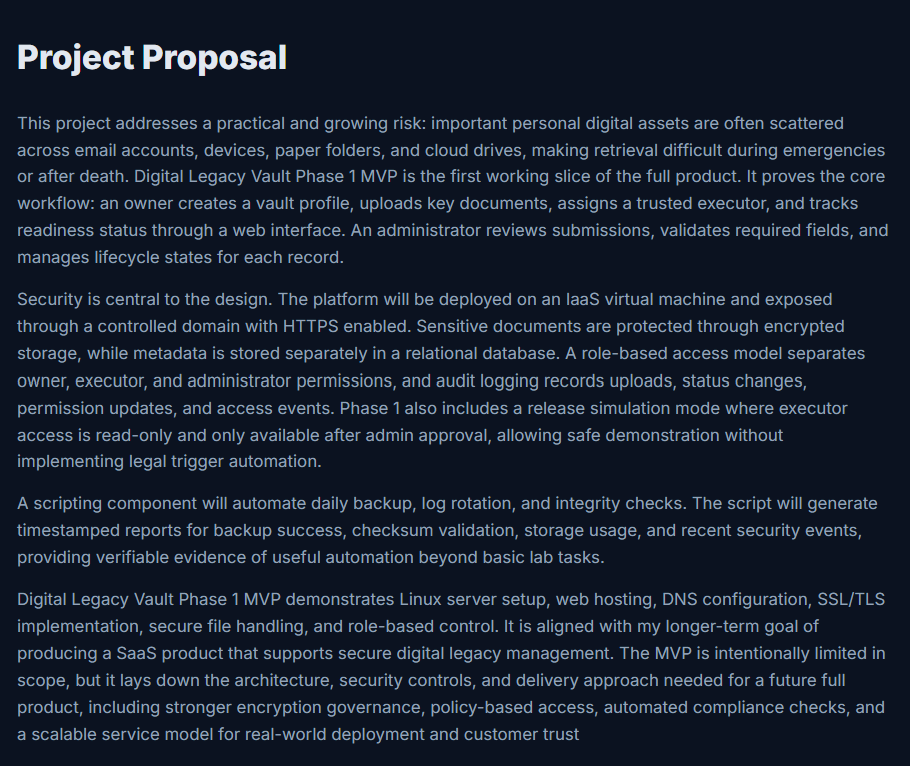
  - 
- [ ] **Screenshot 8:** Page includes copyright and licence contents section
  - Browser scroll to footer
  - 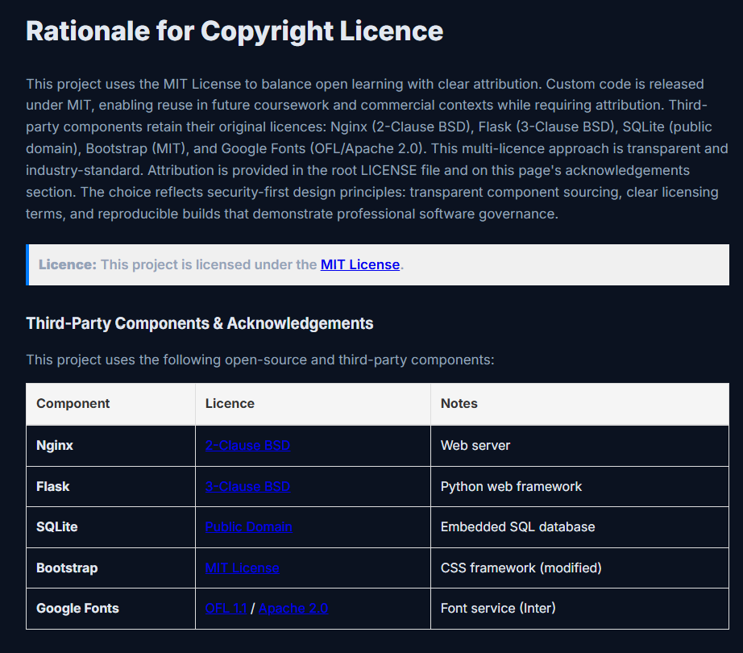

- [ ] **Screenshot 9:** Page includes license marking (MIT License visible)
  - Browser scroll to footer/copyright area
  - 
  
- [ ] **Screenshot 10:** DOM inspection showing all HTML elements rendered
  - Browser DevTools → Elements tab showing structure matches `index.html` template
  - 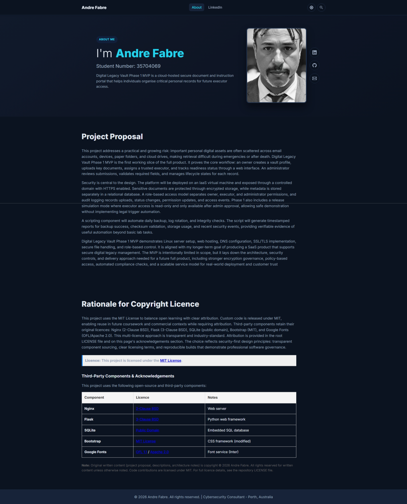

---

## 6. Issues Encountered and Fixes

| Issue | Error Message | Resolution | Status |
|-------|---------------|-----------|--------|
| [Issue 1] | [Expected error if any] | [What was done to fix] | [ ] |
| [Issue 2] | [Expected error if any] | [What was done to fix] | [ ] |
| [Issue 3] | [Expected error if any] | [What was done to fix] | [ ] |

---

## 7. Final Status

**Phase 1 Step 3 Status:** [ ] Complete ✅

**Completion Criteria (all must be true):**
- [x] Web root `/var/www/dlv` created and owned by `www-data`
- [x] All files from `public/` folder deployed to web root
- [x] Nginx server block configured and enabled
- [x] Default Nginx site disabled
- [x] Nginx syntax validated and reloaded
- [x] Landing page serves HTTP 200 on localhost
- [x] Landing page serves HTTP 200 on public IP
- [x] Page contains student ID (visible on page)
- [x] Page contains 300-word proposal description
- [x] Page contains copyright and licence contents section
- [x] Page contains 100-word license rationale
- [x] Page shows MIT License marking
- [x] UFW allows HTTP (port 80) traffic
- [x] All validation commands execute successfully
- [x] All screenshot evidence captured

